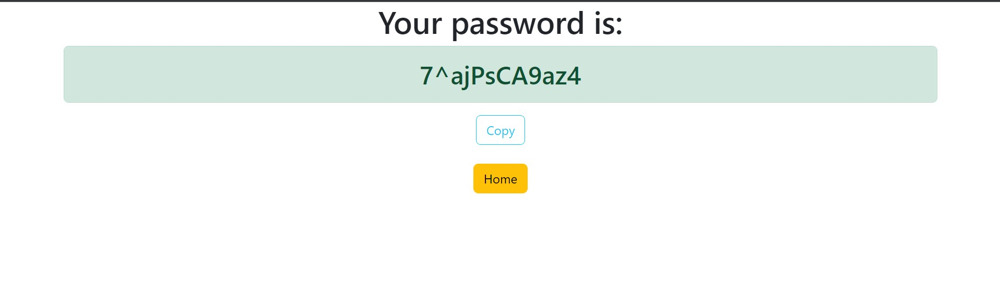

## Random-Password-Generator

This will be a random password generator project based on Django as backend and basic boostrap will be used.


## What can we do from password generator?
A user can generate random password based on different criterias.

## Requirements
Python3 <br/>
django

# How to run this project?
Downlod/Pull the entire folder, download all the dependencies, install django
Then go to cmd and run

```
python manage.py runserver
```


## Home Page
In this page the user will select what kind of password he wants to generate.


## Password Page
The password will be shown here after generating, the user can reload this page to get new password



